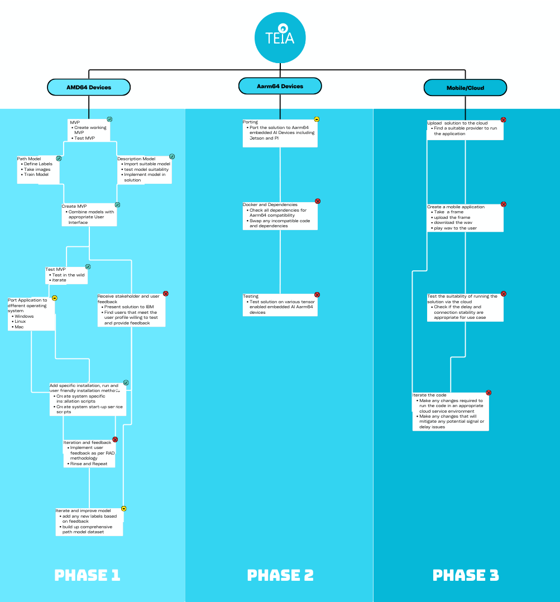

# Teia - an accessible AI implementation

- [Teia - an accessible AI implementation](#teia---an-accessible-ai-implementation)
  - [Project Summary](#project-summary)
    - [Project Goal](#project-goal)
    - [How our technology solution can help](#how-our-technology-solution-can-help)
    - [Our idea](#our-idea)
  - [Technology implementation](#technology-implementation)
    - [IBM Watson product used](#ibm-watson-product-used)
    - [Solution architecture](#solution-architecture)
  - [Presentation materials](#presentation-materials)
    - [Solution demo video](#solution-demo-video)
    - [Project development roadmap](#project-development-roadmap)
  - [Additional details](#additional-details)
    - [How to run the project](#how-to-run-the-project)
    - [Windows](#windows)
    - [Linux](#linux)
    - [Final Remarks](#final-remarks)
    - [License](#license)
    - [References](#references)

## Project Summary

### Project Goal

This project aims to achieve two key objectives: First, to develop an AI model tailored to assist individuals with visual impairments by delivering personalized, relevant information. Second, to create a tool capable of detecting and conveying details about paths, such as obstacles and steps, with the option to switch to a descriptive mode for detailed scene analysis 

### How our technology solution can help

Our AI model delivers relevant information to our users and dynamically generates speech output using Watson Text to Speech.  

### Our idea

The idea for this project came from a news article, which addressed an issue regarding the waiting time for a guide dog. In the UK this can take years, with the average time being eighteen months. Thus this project aims to provide a supplemental aid, where hazard detection and path finding can be simulated using a bespoke AI model. 
This information is then fed into the embedded Watson Text To Speech container and the output wav is then played to the user.

While developing this project it became clear that the user may also want to have a detailed description of the scene before them so a second pre-trained model was included. This model gives a rich description of the frame and passes the output to the embedded Watson Text To Speech container, for a dynamic text to speech solution. 

Considering the user profile, we suggest a bone conduction ear piece so as to not reduce environmental sound reaching the user. The path finding and descriptive modes are switched using the play pause button on the sound device. 

This project can be run on a ubuntu 20.04 laptop, from a backpack and using a external webcam. This webcam can be fitted in any way deemed comfortable by the user. Wether this be head, shoulder or chest fitted. We leave this to the user and those setting up the visual aid. The project is envisioned to run on as many devices as possible. Teia does not aim to replace conventional aides but rather supplement existing primary aides.

## Technology implementation

### IBM Watson product used


[IBM Watson speech libraries for embed](https://www.ibm.com/products/speech-embed-libraries?) - the interface that connects the model outputs to the user, through wav generation, allowing the application to have an accessible human-computer interaction.

[Free trial link](https://www.ibm.com/account/reg/us-en/signup?formid=urx-51754)

*Example of Where Watson For Embed Text To Speech is used*:


### Solution architecture

Diagram and step-by-step description of the flow of our solution:


---
**Application flow**:
 1. Model generates a description 
 2. Description string is passed to the Watson text to speech container 
 3. Watson text to speech generates wav file
 4. Wav file containing the description is played to the user
 5. The user switches model using the play/pause button

---

## Presentation materials

### Solution demo video

https://github.com/user-attachments/assets/de416b8a-bda4-49d7-9434-ce452605e57c

### Project development roadmap

The project currently does the following things.

- Runs on Windows 11 and Ubuntu 20.04
- Presents user with an alpha path finding model
- Presents the user with a mature descriptive model
- Implements an accessible Human-computer interface using Watson IBM text to speech
- Runs as a startup service

In the future we plan to...
 
 - ~~Add a silent mode, currently the MVP cycles between the two modes but there should be the option to have no output. This is a priority user experience update that will be done shortly~~
 - Put time and investment into building our bespoke path finding model. This will primarily be an effort of collecting images and categorising them for a multi-label dataset.
 - Work with IBM to create an AARM64 architecture Watson text to speech container so we can port the project into small embedded AI platforms. 
 - Try to port the project into a mobile application, to test using 4g or 5g to run live cloud inference and testing the response time. 
 - Develop the project into maturation using Rapid Appilcation Development, such that the user profile will be in close collaboration with the project
 - Bring the project to all tensor enabled devices, such that the user can implement the solution with any AI enabled device
 - Conduct extensive optimisation, meeting the previous goal of compatible device ubiquity




## Additional details

### How to run the project

The Project currently has two versions, one for Ubuntu 20.04 and the other for Windows 11 (Though this may work on Windows 10 but has not been tested and confirmed to do so)

**Important**

> Teia is a software layer that requires a tensor or cuda enabled laptop, webcam and headset/earpiece. We recommend using a bone conduction earpiece so as to not reduce environmental sound. The models are toggled using the play/pause button on the sound output device. In the future this will also include embedded AI devices. 
 
>For using as a visual aid, the laptop should be placed in a waterproof backpack and the webcam should itself be waterproof, connecting a powerbank would be prefereable. Additional code will soon be included to detect wireless webcams, in the future.
How the webcam is fastened to the user will be left to the person setting up the project, whether this be shoulder, head or chest mounted. 
As the project matures, there is an aim to deliver extensive tutorials as to how this may be done, with consideration to potentially including 3d printing. Though this could be community driven, depending on the support attained from my fellow developers. 

**The path model is set to inference every 5 seconds and the description is set to inference every 40 seconds, this will be adjusted in the future depending on our users preference. The path model will not repeat the same labels detected on the previous inference, to mitigate the same inference label being played over and over. Only newly detected labels will be played.**

### Windows
---

*The cloned folder must be placed on the desktop for the pathing to be correct - this will be changed in the future*

*For a demonstration*

1. Visit https://www.ibm.com/account/reg/us-en/signup?formid=urx-51754 to signup for Watson Text To Speech (No Card Needed).
2. Visit https://myibm.ibm.com/products-services/containerlibrary to create your entitlement key (there may be an hour delay before a new key becomes activate and you'll only need to add your key once). Once you have it, copy it.
3. Start win-setup.exe.
4. Paste your entitlement key when prompted (Right click in the console to paste).
5. Start run.exe to begin downloading the description model, this only needs to be done once and then the model will be loaded from cache.
6. Now start run.exe to see a demonstration .
7. Press play/pause on your headset or earbud to change models, initial change will spin up the description model.

*Additional installation instructions for the actual real world use case*

*This will put the application into headless mode, this means it will automatically start when the laptop is turned on*

- If you don't have OneDrive then follow this section
  1. Start setup-run-on-startup.exe.
  2. Restart to confirm the application runs automatically (There is a noticable delay of 3-5 minutes, due to the application needing windows to complete it's startup initialisation for any sound drivers and other dependencies).
  3. To stop the application running on startup run remove-run-on-startup.exe.
- If you have OneDrive then follow this section
  1. Start setup-run-on-startup-onedrive.exe.
  2. Restart to confirm the application runs automatically (There is a noticable delay of 3-5 minutes, due to the application needing windows to complete it's startup initialisation for any sound drivers and other dependencies).
  3. To stop the application running on startup run remove-run-on-startup-onedrive.exe. 

### Linux
---

*For a demonstration*

1. Visit https://www.ibm.com/account/reg/us-en/signup?formid=urx-51754 to signup for Watson Text To Speech (No Card Needed).
2. Visit https://myibm.ibm.com/products-services/containerlibrary to create your entitlement key (there may be an hour delay before a new key becomes activate and you'll only need to add your key once). Once you have it, copy it.
3. Open the folder containing Teia and navigate to the linux folder.
4. Right click on the empty space inside the folder and select "Open in terminal".
5. Type the following command into the terminal ```sudo chmod +x setup.sh``` and press enter.
6. Type the following command inthe terminal ```sudo chmod +x setup-run-on-start.sh``` and press enter.
7. In the terminal type ```sudo bash setup.sh {IBM Entitlement Key}``` Where you see {IBM Entitlement key} paste in your key by right clicking in the terminal and selecting paste, then press enter. *Tip: when you paste your key, there should be no {} brackets*
8. When the setup finishes type ```sudo bash run.sh``` and wait for the description model to download, you will not need to download the model again as it will be loaded from cache.
9. When the download finishes, the application will start, you can either see a demonstration or close the terminals and continue with the setup.
10. Use play/pause to switch mode between description model and path model.

*Additional installation instructions for the actual real world use case*

*This will put the application into headless mode, this means it will automatically start when the laptop is turned on*

1. To continue with the setup, open a terminal in the same folder and manner described in steps 3 and 4 above.
2. Enter the following command ```sudo bash setup-run-on-start.sh``` and press enter
3. Restart to confirm the application runs automatically.
4. To stop the application running on startup, open a terminal with CTRL + ALT + T and type the following commands ```sudo systemctl stop teia``` press enter and then type ```sudo systemctl disable teia```

### Final Remarks
---

The current state of this project is in alpha, while awaiting it's first user feedback. There are issues which have already been detected, such as stacking of audio plays, delayed start and switching. We aim to fix this as soon as possible. This project will be picked up by my current university group and I hope to expand the development support through social media exposure. Please bare with me as I'm learning a whole bunch of new languages and technology, my current experience before starting this project was full-stack react, javascript and SQL, Java and some Kotlin. For this project I had to design my ideas in javascript and manually transpile them into python. while also learning the linux system, bash, powershell and machine learning/tensorflow. I really believe in this project and the good it can offer the world. If anyone wants to help me develop this, your support and knowledge will be greatly appreciated. 

Regards,

Martin Cameron.

### License
---

This project is licensed under the Creative Commons Attribution-NonCommercial 4.0 International License - see the [LICENSE](./LICENSE) file for details.


### References
---

Aydogan G. (n.d), *PaliGemma Fine-tuned for Long Captioning for Stable Diffusion 3*, [online]. Available from <https://huggingface.co/spaces/gokaygokay/SD3-Long-Captioner> [16 October 2024]


